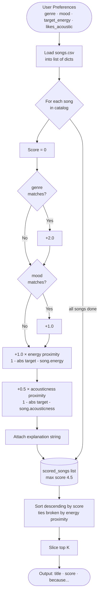

# 🎵 Music Recommender Simulation

## Project Summary

In this project you will build and explain a small music recommender system.

Your goal is to:

- Represent songs and a user "taste profile" as data
- Design a scoring rule that turns that data into recommendations
- Evaluate what your system gets right and wrong
- Reflect on how this mirrors real world AI recommenders

This simulation builds a content-based music recommender that scores songs by comparing their attributes against a user's taste profile. It prioritizes feature proximity over simple ranking — rewarding songs that are *closest* to what the user wants rather than songs that merely score highest on any single dimension. The system uses a weighted formula across genre, mood, energy, and acousticness to produce a single compatibility score per song, then returns the top-k results.

---

## How The System Works

Explain your design in plain language.
- Real-world recommenders like Spotify's Discover Weekly blend two strategies: **collaborative filtering** (finding users with similar listening histories and borrowing their discoveries) and **content-based filtering** (matching a song's measurable audio attributes — energy, tempo, mood — to a listener's taste profile). At scale, platforms layer these with contextual signals like time of day and device type, and use deep learning to weight everything automatically from billions of interactions. This simulation focuses on the content-based side of that picture — it scores songs by computing how closely each track's attributes match the user's stated preferences, using a transparent weighted formula rather than a learned model. The priority here is **explainability**: every recommendation comes with a human-readable reason tied directly to the features that drove the score.

Some prompts to answer:

- What features does each `Song` use in your system
  - For example: genre, mood, energy, tempo
    - Each `Song` object stores the following attributes:

    | Feature | Type | What it captures |
    |---|---|---|
    | `id` | int | Unique identifier |
    | `title` | str | Song name |
    | `artist` | str | Artist name |
    | `genre` | str | Musical genre (pop, lofi, rock, ambient, jazz, synthwave, indie pop) |
    | `mood` | str | Emotional tone (happy, chill, intense, relaxed, focused, moody) |
    | `energy` | float (0–1) | Perceived intensity and activity level |
    | `tempo_bpm` | float | Speed in beats per minute |
    | `valence` | float (0–1) | Musical positiveness — high = happy/euphoric, low = sad/dark |
    | `danceability` | float (0–1) | Rhythmic suitability for dancing |
    | `acousticness` | float (0–1) | Acoustic (organic) vs. electronic/produced texture |
- What information does your `UserProfile` store
  - Each `UserProfile` stores the user's taste preferences:

  | Field | Type | Role in scoring |
  |---|---|---|
  | `favorite_genre` | str | Matched exactly against `song.genre` (weight: 0.35) |
  | `favorite_mood` | str | Matched exactly against `song.mood` (weight: 0.25) |
  | `target_energy` | float (0–1) | Proximity-scored against `song.energy` (weight: 0.25) |
  | `likes_acoustic` | bool | Converts to target acousticness (0.8 if True, 0.2 if False); proximity-scored (weight: 0.15) |

- How does your `Recommender` compute a score for each song
  - **Scoring Rule** — each song receives a compatibility score in [0.0, 1.0]:

  ```
  score = 0.35 × genre_match
        + 0.25 × mood_match
        + 0.25 × (1 - |target_energy - song.energy|)
        + 0.15 × (1 - |acousticness_target - song.acousticness|)
  ```
- How do you choose which songs to recommend
  - Categorical features (genre, mood) produce 1.0 for an exact match, 0.0 otherwise. Numeric features use inverted absolute difference so that proximity to the user's target — not raw magnitude — is rewarded.

  - **Ranking Rule** — after all songs are scored, the list is sorted descending by score and the top-k results are returned. Ties are broken by `energy` proximity.

### Algorithm Recipe

A content-based recommender using an **additive point system**. No machine learning — fully transparent and rule-based. Max possible score: **4.5 pts**.

**Scoring Rule** (one song at a time):

```
score = 2.0 × genre_match
      + 1.0 × mood_match
      + 1.0 × (1 - |target_energy - song.energy|)
      + 0.5 × (1 - |acousticness_target - song.acousticness|)
```

- Categorical features (genre, mood): exact match = 1, no match = 0
- Numeric features (energy, acousticness): inverted absolute difference — proximity to the user's target is rewarded, not raw magnitude
- `acousticness_target` is derived from `likes_acoustic`: `0.8` if `True`, `0.2` if `False`

**Feature Points:**

| Feature | Points | Max | Reasoning |
|---|---|---|---|
| `genre` | +2.0 if match | 2.0 | Strongest taste boundary — a jazz fan won't tolerate EDM |
| `mood` | +1.0 if match | 1.0 | Captures listener intent (study vs. party) |
| `energy` | +1.0 × proximity | 1.0 | Most discriminating numeric axis — workout vs. sleep |
| `acousticness` | +0.5 × proximity | 0.5 | Texture/production feel — organic vs. electronic |

**Ranking Rule** (across the catalog):
1. Run the scoring rule against every song
2. Sort descending by score
3. Return top-k results; break ties by energy proximity

### Known Limitation

With only one song per genre in the catalog, the +2.0 genre points are too decisive — they surface the single genre-matching song regardless of mood fit. If extending the catalog, consider lowering genre to +1.0 and adding valence as a scored feature to better separate emotional tone within a genre.

You can include a simple diagram or bullet list if helpful.



---

## Getting Started

### Setup

1. Create a virtual environment (optional but recommended):

   ```bash
   python -m venv .venv
   source .venv/bin/activate      # Mac or Linux
   .venv\Scripts\activate         # Windows

2. Install dependencies

```bash
pip install -r requirements.txt
```

3. Run the app:

```bash
python -m src.main
```

### Running Tests

Run the starter tests with:

```bash
pytest
```

You can add more tests in `tests/test_recommender.py`.

---

## Experiments You Tried

Use this section to document the experiments you ran. For example:

- What happened when you changed the weight on genre from 2.0 to 0.5
- What happened when you added tempo or valence to the score
- How did your system behave for different types of users

---

## Limitations and Risks

Summarize some limitations of your recommender.

Examples:

- It only works on a tiny catalog
- It does not understand lyrics or language
- It might over favor one genre or mood

You will go deeper on this in your model card.

---

## Reflection

Read and complete `model_card.md`:

[**Model Card**](model_card.md)

Write 1 to 2 paragraphs here about what you learned:

- about how recommenders turn data into predictions
- about where bias or unfairness could show up in systems like this


---

## 7. `model_card_template.md`

Combines reflection and model card framing from the Module 3 guidance. :contentReference[oaicite:2]{index=2}  

```markdown
# 🎧 Model Card - Music Recommender Simulation

## 1. Model Name

Give your recommender a name, for example:

> VibeFinder 1.0

---

## 2. Intended Use

- What is this system trying to do
- Who is it for

Example:

> This model suggests 3 to 5 songs from a small catalog based on a user's preferred genre, mood, and energy level. It is for classroom exploration only, not for real users.

---

## 3. How It Works (Short Explanation)

Describe your scoring logic in plain language.

- What features of each song does it consider
- What information about the user does it use
- How does it turn those into a number

Try to avoid code in this section, treat it like an explanation to a non programmer.

---

## 4. Data

Describe your dataset.

- How many songs are in `data/songs.csv`
- Did you add or remove any songs
- What kinds of genres or moods are represented
- Whose taste does this data mostly reflect

---

## 5. Strengths

Where does your recommender work well

You can think about:
- Situations where the top results "felt right"
- Particular user profiles it served well
- Simplicity or transparency benefits

---

## 6. Limitations and Bias

Where does your recommender struggle

Some prompts:
- Does it ignore some genres or moods
- Does it treat all users as if they have the same taste shape
- Is it biased toward high energy or one genre by default
- How could this be unfair if used in a real product

---

## 7. Evaluation

How did you check your system

Examples:
- You tried multiple user profiles and wrote down whether the results matched your expectations
- You compared your simulation to what a real app like Spotify or YouTube tends to recommend
- You wrote tests for your scoring logic

You do not need a numeric metric, but if you used one, explain what it measures.

---

## 8. Future Work

If you had more time, how would you improve this recommender

Examples:

- Add support for multiple users and "group vibe" recommendations
- Balance diversity of songs instead of always picking the closest match
- Use more features, like tempo ranges or lyric themes

---

## 9. Personal Reflection

A few sentences about what you learned:

- What surprised you about how your system behaved
- How did building this change how you think about real music recommenders
- Where do you think human judgment still matters, even if the model seems "smart"

