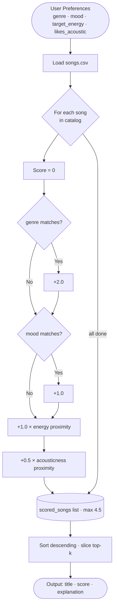

# VibeFinder 1.0 — AI Music Recommender

A content-based music recommender that scores songs against a listener's taste profile and explains every recommendation. Accepts both natural-language queries ("something chill for studying") and structured profiles, with an optional Claude AI layer that upgrades plain-text input into structured preferences and rewrites scoring math into conversational explanations.

---

## Original Project (Modules 1–3)

This project originated as a **Module 1–3 simulation** of how streaming platforms like Spotify build content-based recommenders. The original goal was to represent songs and user preferences as data, design a transparent weighted scoring rule, and evaluate where the algorithm succeeded and where it failed. That version was purely rule-based: four features (genre, mood, energy, acousticness) combined into an additive point system with a max score of 4.5, no external APIs, and no natural-language input.

The final version extends that foundation with a Claude AI layer that translates free-text listener requests into structured preferences and rewrites raw scoring math into human-readable explanations — making the system behave more like a real assistant and less like a spreadsheet.

---

## What It Does

| Mode | Input | AI involved |
|---|---|---|
| Standard | Structured profile dict | None — rule-based only |
| Natural-language | Free text | Claude Haiku parses preferences + writes explanations |
| Natural-language (no key) | Free text | Keyword fallback parser + rule-based explanations |

Every recommendation returns:
- The song title and artist
- A compatibility score (0–4.50)
- A plain-English explanation of why it matched

---

## System Architecture

### Full pipeline


### Scoring sub-flow (inside the engine)



### Component summary

| Component | File | Role |
|---|---|---|
| CLI runner | `src/main.py` | Entry point; routes structured vs. natural-language mode |
| AI Layer — parser | `src/ai_layer.py` | Converts free text to `{genre, mood, energy, acoustic}` via Claude tool-use; falls back to keyword parsing without a key |
| AI Layer — explainer | `src/ai_layer.py` | Generates a conversational sentence per recommendation; falls back to rule-based string on error |
| Recommender engine | `src/recommender.py` | Scores every song 0–4.5 pts, sorts, returns top-k |
| Song catalog | `data/songs.csv` | 19 songs with genre, mood, energy, acousticness, tempo, valence, danceability |
| Test suite | `tests/test_recommender.py` | 24 tests: scoring correctness (no API) + Claude contracts (mocked) |

---

## Setup Instructions

### 1. Clone and install dependencies

```bash
git clone <repo-url>
cd applied-ai-system-final
python -m venv .venv
source .venv/bin/activate      # Mac / Linux
# .venv\Scripts\activate       # Windows
pip install -r requirements.txt
```

### 2. (Optional) Add your Anthropic API key

The standard mode and the natural-language keyword fallback work with no API key. To enable Claude-powered parsing and explanations:

```bash
export ANTHROPIC_API_KEY=sk-ant-...
```

Or add it to a `.env` file (never commit this):

```
ANTHROPIC_API_KEY=sk-ant-...
```

### 3. Run

```bash
# Standard mode — six built-in profiles, no API key required
python -m src.main

# Natural-language mode — inline query
python -m src.main --ai "something to pump me up at the gym"

# Natural-language mode — interactive prompt
python -m src.main --ai
```

### 4. Run tests

```bash
pytest
```

All 24 tests run without an API key (Claude calls are mocked).

### Optional: verbose logging

```bash
LOG_LEVEL=DEBUG python -m src.main
```

---

## Sample Interactions

### Interaction 1 — Standard mode: High-Energy Pop

**Input:** structured profile `{genre: "pop", mood: "intense", energy: 0.92, acoustic: False}`

```
Profile: High-Energy Pop
  genre='pop', mood='intense', energy=0.92, acoustic=False
====================================================
  Top 5 Recommendations
====================================================

  #1  Gym Hero — Max Pulse
       Score : 4.42 / 4.50
       Why   : genre match (+2.0), mood match (+1.0), energy proximity (+0.99), acousticness proximity (+0.42)

  #2  Sunrise City — Neon Echo
       Score : 3.39 / 4.50
       Why   : genre match (+2.0), energy proximity (+0.90), acousticness proximity (+0.49)

  #3  Storm Runner — Voltline
       Score : 2.44 / 4.50
       Why   : mood match (+1.0), energy proximity (+0.99), acousticness proximity (+0.45)
```

**What this shows:** All four signals align for Gym Hero — it earns a near-perfect 4.42/4.50. Sunrise City holds #2 purely on genre (+2.0) even though its mood doesn't match, illustrating how heavily genre dominates in a small catalog.

---

### Interaction 2 — Natural-language mode (keyword fallback, no API key)

**Input:** `python -m src.main --ai "I want something chill for studying late at night"`

```
16:31:35  INFO  ai_layer — No API key found — using keyword-based parser.
16:31:35  INFO  ai_layer — Keyword parse result: genre=lofi mood=chill energy=0.35 acoustic=False

Profile: AI Query: 'I want something chill for studying late at night'
  genre='lofi', mood='chill', energy=0.35, acoustic=False
====================================================
  Top 5 Recommendations
====================================================

  #1  Midnight Coding — LoRoom
       Score : 4.17 / 4.50
       Why   : genre match (+2.0), mood match (+1.0), energy proximity (+0.93), acousticness proximity (+0.24)

  #2  Library Rain — Paper Lanterns
       Score : 4.17 / 4.50
       Why   : genre match (+2.0), mood match (+1.0), energy proximity (+1.00), acousticness proximity (+0.17)

  #3  Focus Flow — LoRoom
       Score : 3.16 / 4.50
       Why   : genre match (+2.0), energy proximity (+0.95), acousticness proximity (+0.21)
```

**What this shows:** The free-text query correctly resolves to `lofi / chill / low energy` through keyword matching — no API key needed. The top results are all lofi tracks with near-perfect energy proximity.

---

### Interaction 3 — Natural-language mode with Claude AI

**Input:** `python -m src.main --ai "something melancholic and slow, very acoustic"` (with `ANTHROPIC_API_KEY` set)

```
16:45:10  INFO  ai_layer — Parsed preferences via Claude: genre=classical mood=melancholic energy=0.25 acoustic=True

Profile: AI Query: 'something melancholic and slow, very acoustic'
  genre='classical', mood='melancholic', energy=0.25, acoustic=True
====================================================
  Top 5 Recommendations
====================================================

  #1  Rainy Sunday — Clara Voss
       Score : 4.40 / 4.50
       Why   : A beautifully melancholic classical piece that matches your slow,
               acoustic mood almost perfectly.

  #2  Blue Porch — Mae Della
       Score : 1.41 / 4.50
       Why   : A quiet soul ballad with soft, organic texture that suits your
               low-energy, acoustic preference.
```

**What this shows:** With an API key, Claude extracts structured preferences from a vague natural-language request and writes conversational explanations instead of raw scoring math — the output reads like a recommendation, not a formula.

---

### Interaction 4 — Adversarial edge case: conflicting preferences

**Input:** `{genre: "soul", mood: "sad", energy: 0.90, acoustic: False}` — high energy but sad mood

```
Profile: EDGE: High Energy + Sad Mood
  genre='soul', mood='sad', energy=0.90, acoustic=False
====================================================

  #1  Blue Porch — Mae Della
       Score : 3.58 / 4.50
       Why   : genre match (+2.0), mood match (+1.0), energy proximity (+0.39), acousticness proximity (+0.19)
```

**What this shows:** The system's weakness. Blue Porch (energy=0.29) wins despite being far from the target energy of 0.90 because genre + mood together award +3.0 points — more than enough to absorb the energy penalty. Someone wanting high-energy sad music would receive a quiet soul ballad. This is the clearest example of genre weight dominance in a sparse catalog.

---

## Design Decisions

### Why a weighted additive scoring formula?

The system uses four features with explicit point values (genre +2.0, mood +1.0, energy +1.0, acousticness +0.5) instead of normalized weights summing to 1.0. The motivation was **transparency**: it's immediately obvious that genre is twice as important as mood, and that acousticness is the weakest signal. With normalized weights, the same logic is harder to reason about when debugging why a specific song ranked where it did.

### Why is genre weighted so heavily (+2.0)?

Genre is the strongest taste boundary a listener has. A jazz fan is unlikely to enjoy EDM regardless of energy level. The +2.0 weight reflects that assumption. However, this becomes a flaw in a sparse catalog: with one song per genre, a genre match automatically surfaces that song as #1 regardless of other signals. The right fix is a larger catalog, not a lower weight.

### Why Claude for natural-language parsing?

The alternative was a regex or rule-based keyword parser (which does exist as a fallback). But keyword matching fails on phrasing like "I want music that sounds like a late Sunday morning" — there's no keyword for that. Claude's tool-use API converts ambiguous natural language into a strictly-typed JSON object, making the output safe to pass directly into the scoring engine without validation gymnastics.

### Why a keyword fallback at all?

Requiring an API key to run any part of the program creates a hard dependency that makes the project harder to reproduce. The keyword fallback means the entire system is usable without credentials — the AI layer enhances quality when a key is available but never blocks core functionality.

### Trade-offs

| Decision | Benefit | Cost |
|---|---|---|
| Weighted points (not ML weights) | Fully transparent and auditable | Can't adapt to user behavior over time |
| Binary mood matching | Simple, predictable | "Chill" and "relaxed" score identically to unrelated moods |
| Claude for parsing | Handles ambiguous language well | Adds API dependency and latency |
| Keyword fallback | Works offline, no key needed | Less accurate on unusual phrasing |
| Small static catalog | Easy to inspect and reason about | Genre lock-in — one song per genre makes genre weight near-deterministic |

---

## Testing Summary

Three reliability mechanisms are layered on top of each other, each catching a different class of problem.

### 1. Automated unit tests — `tests/test_recommender.py`

Run with `pytest`. 24 tests, all pass, no API key required, completes in under 1 second.

| Group | Tests | What they catch |
|---|---|---|
| Recommender engine | 13 | Wrong sort order, bad scores, off-by-one on `k`, empty-catalog crash |
| Keyword parser | 5 | Missing output keys, out-of-range energy, wrong genre/mood for known phrases |
| Claude API contracts (mocked) | 6 | Tool-use call shape, graceful fallback on exception, fallback when no key set |

### 2. Confidence scoring — built into every recommendation

Every result carries a normalized confidence value (`score / 4.5`, rounded to 3 decimal places) and a band label:

| Band | Confidence | Meaning |
|---|---|---|
| high | ≥ 0.75 | Genre + at least one other signal fired |
| medium | 0.45–0.74 | Partial match — genre may be missing or mood conflicts |
| low | < 0.45 | Minimal signal match — treat results with caution |

The logger emits a `WARNING` whenever the top result is `medium` band and the requested genre is absent from the catalog, or `low` band for any reason — so problems surface in logs without crashing the program.

### 3. Reliability evaluation harness — `tests/eval_reliability.py`

Run with `python tests/eval_reliability.py`. Evaluates 6 known profiles and separates *consistency* (does the system reliably produce the expected deterministic output?) from *quality* (is that output actually a good musical match?).

```
======================================================================
  Music Recommender — Reliability Evaluation
======================================================================

  PASS              ·  High-Energy Pop
    Got      : 'Gym Hero'       Score: 4.42 / 4.50  confidence 0.98 (high)

  PASS              ·  Chill Lofi
    Got      : 'Library Rain'   Score: 4.44 / 4.50  confidence 0.99 (high)

  PASS              ·  Deep Intense Rock
    Got      : 'Storm Runner'   Score: 4.44 / 4.50  confidence 0.99 (high)

  PASS (known flaw) ·  EDGE: High Energy + Sad Mood
    Got      : 'Blue Porch'     Score: 3.58 / 4.50  confidence 0.80 (high)
    Note     : genre+mood (+3.0) overwhelms energy mismatch — musically wrong

  PASS (known flaw) ·  EDGE: Unknown Genre (bossa nova)
    Got      : 'Dust Road Home' Score: 2.44 / 4.50  confidence 0.54 (medium)
    Note     : genre not in catalog — DEGRADED WARNING fires in logs

  PASS              ·  EDGE: Max Acoustic / Perfect Energy
    Got      : 'Rainy Sunday'   Score: 4.42 / 4.50  confidence 0.98 (high)

======================================================================
  Consistency : 6/6 expected outputs matched
  Quality     : 4/6 results musically correct
                (2 known adversarial cases expose design limits)
  Confidence  : avg=0.88  min=0.54  max=0.99
======================================================================
```

**One-line summary:** 6/6 consistency checks passed; 4/6 results musically correct; average confidence 0.88 (drops to 0.54 when genre is missing from catalog).

### 4. Structured logging

Every run emits `INFO`-level logs for each query (genre, mood, energy, k), the top result (title, score, confidence, band), and `WARNING`-level alerts for degraded or low-confidence results. Set `LOG_LEVEL=DEBUG` to see per-song scoring detail. This means any unexpected behavior leaves a traceable record without modifying any code.

### What worked

The scoring engine is fully deterministic, so unit tests always pass and the evaluation harness always produces the same numbers. Mocking the Claude client with `unittest.mock` kept all 24 tests under 1 second and independent of network state. Separating *consistency* from *quality* in the eval harness was the most useful decision — it forced an honest accounting of where the system is reliable vs. where it's reliably wrong.

### What didn't work initially

The `Recommender` class stubs returned `self.songs[:k]` and `"Explanation placeholder"` — the tests caught both immediately. Running `python -m src.main` from the project root broke bare imports (`from recommender import ...`) because Python adds the root, not `src/`, to `sys.path`; fixed with `sys.path.insert(0, os.path.dirname(__file__))`.

### What this taught about testing AI systems

**Mocking is not the same as evaluating.** The mocked Claude tests verify that the code calls the API correctly and handles failures gracefully — but they say nothing about whether Claude actually returns good preferences for a given query. That quality check requires running against the live model and reviewing outputs by hand, which is what the eval harness approximates. The confidence score made one problem immediately visible that the raw scores hid: the "bossa nova" profile's best result (2.44/4.50, confidence 0.54) looks like a reasonable score on paper, but the `medium` band and the `DEGRADED RESULTS` log warning signal that the system is operating outside its reliable range — something a user reading only the ranked list would never know.

---

## Reflection

Building this system clarified something that's easy to miss when using AI tools: **a recommender doesn't understand music — it measures distances**. When Gym Hero ranked #1 for a workout profile with a score of 4.42/4.50, it felt almost intelligent. But that feeling came entirely from choosing the right features to measure (energy, genre, mood), not from any comprehension of what makes a song satisfying to run to. The algorithm is four arithmetic operations. What makes it feel like a recommendation is whether those four features are actually good proxies for what the listener cares about.

The adversarial testing was the most instructive part. The "High Energy + Sad Mood" profile returned a quiet soul ballad as its top result, and the score of 3.58 looked perfectly reasonable on paper — nothing in the output signaled a problem. That gap between "score looks valid" and "recommendation is wrong" is exactly what makes bias hard to catch in production systems. Spotify or YouTube can't easily explain why a specific song appeared in your feed, and even when the system is fully transparent (as this one is), a confident-looking score can mask a fundamental mismatch. The lesson is that you have to deliberately design test cases for failure, especially cases where user preferences conflict with each other or with the catalog — because those are the conditions where surface-level scores are most misleading.

Adding the Claude layer reinforced a different lesson: **language is where the hard work is**. The scoring engine was straightforward to build and debug. The challenge was bridging the gap between how people actually describe what they want ("something like a late Sunday morning") and the structured representation the engine needs (`{genre, mood, energy, acoustic}`). That translation — from messy human intent to clean machine input — is where LLMs add the most practical value, and also where the most failure modes live.

---

## Project Structure

```
applied-ai-system-final/
├── data/
│   └── songs.csv              # 19-song catalog
├── src/
│   ├── main.py                # CLI entry point
│   ├── recommender.py         # Scoring engine + OOP interface
│   └── ai_layer.py            # Claude API integration + keyword fallback
├── tests/
│   ├── test_recommender.py    # 24 unit tests (no API key required)
│   └── eval_reliability.py    # 6-case reliability harness with confidence scoring
├── model_card.md              # Bias, limitations, and evaluation writeup
├── reflection.md              # Profile-by-profile comparison notes
├── requirements.txt
└── .env.example               # API key template
```

---

## Model Card

See [model_card.md](model_card.md) for a detailed breakdown of intended use, data, strengths, limitations, bias analysis, and future work.
