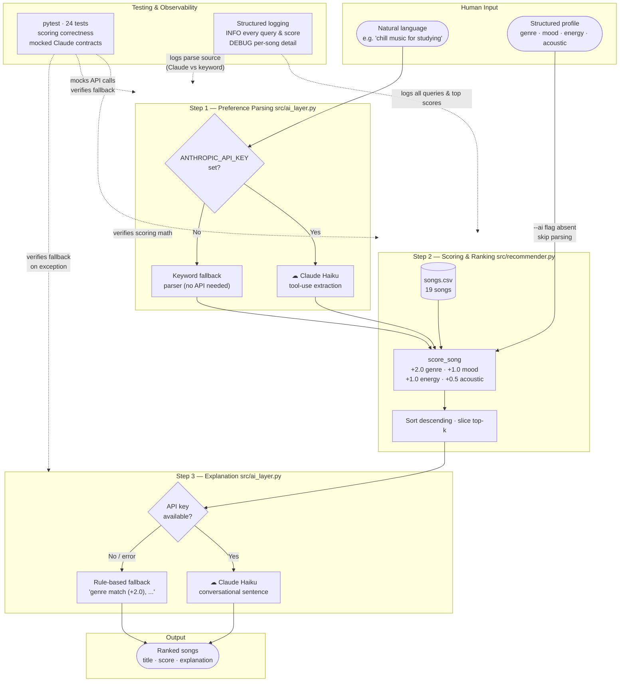

# 🎵 Music Recommender Simulation

## Project Summary

In this project you will build and explain a small music recommender system.

Your goal is to:

- Represent songs and a user "taste profile" as data
- Design a scoring rule that turns that data into recommendations
- Evaluate what your system gets right and wrong
- Reflect on how this mirrors real world AI recommenders

This simulation builds a content-based music recommender that scores songs by comparing their attributes against a user's taste profile. It prioritizes feature proximity over simple ranking — rewarding songs that are *closest* to what the user wants rather than songs that merely score highest on any single dimension. The system uses a weighted formula across genre, mood, energy, and acousticness to produce a single compatibility score per song, then returns the top-k results.

---

## How The System Works

Explain your design in plain language.
- Real-world recommenders like Spotify's Discover Weekly blend two strategies: **collaborative filtering** (finding users with similar listening histories and borrowing their discoveries) and **content-based filtering** (matching a song's measurable audio attributes — energy, tempo, mood — to a listener's taste profile). At scale, platforms layer these with contextual signals like time of day and device type, and use deep learning to weight everything automatically from billions of interactions. This simulation focuses on the content-based side of that picture — it scores songs by computing how closely each track's attributes match the user's stated preferences, using a transparent weighted formula rather than a learned model. The priority here is **explainability**: every recommendation comes with a human-readable reason tied directly to the features that drove the score.

Some prompts to answer:

- What features does each `Song` use in your system
  - For example: genre, mood, energy, tempo
    - Each `Song` object stores the following attributes:

    | Feature | Type | What it captures |
    |---|---|---|
    | `id` | int | Unique identifier |
    | `title` | str | Song name |
    | `artist` | str | Artist name |
    | `genre` | str | Musical genre (pop, lofi, rock, ambient, jazz, synthwave, indie pop) |
    | `mood` | str | Emotional tone (happy, chill, intense, relaxed, focused, moody) |
    | `energy` | float (0–1) | Perceived intensity and activity level |
    | `tempo_bpm` | float | Speed in beats per minute |
    | `valence` | float (0–1) | Musical positiveness — high = happy/euphoric, low = sad/dark |
    | `danceability` | float (0–1) | Rhythmic suitability for dancing |
    | `acousticness` | float (0–1) | Acoustic (organic) vs. electronic/produced texture |
- What information does your `UserProfile` store
  - Each `UserProfile` stores the user's taste preferences:

  | Field | Type | Role in scoring |
  |---|---|---|
  | `favorite_genre` | str | Matched exactly against `song.genre` (weight: 0.35) |
  | `favorite_mood` | str | Matched exactly against `song.mood` (weight: 0.25) |
  | `target_energy` | float (0–1) | Proximity-scored against `song.energy` (weight: 0.25) |
  | `likes_acoustic` | bool | Converts to target acousticness (0.8 if True, 0.2 if False); proximity-scored (weight: 0.15) |

- How does your `Recommender` compute a score for each song
  - **Scoring Rule** — each song receives a compatibility score in [0.0, 1.0]:

  ```
  score = 0.35 × genre_match
        + 0.25 × mood_match
        + 0.25 × (1 - |target_energy - song.energy|)
        + 0.15 × (1 - |acousticness_target - song.acousticness|)
  ```
- How do you choose which songs to recommend
  - Categorical features (genre, mood) produce 1.0 for an exact match, 0.0 otherwise. Numeric features use inverted absolute difference so that proximity to the user's target — not raw magnitude — is rewarded.

  - **Ranking Rule** — after all songs are scored, the list is sorted descending by score and the top-k results are returned. Ties are broken by `energy` proximity.

### Algorithm Recipe

A content-based recommender using an **additive point system**. No machine learning — fully transparent and rule-based. Max possible score: **4.5 pts**.

**Scoring Rule** (one song at a time):

```
score = 2.0 × genre_match
      + 1.0 × mood_match
      + 1.0 × (1 - |target_energy - song.energy|)
      + 0.5 × (1 - |acousticness_target - song.acousticness|)
```

- Categorical features (genre, mood): exact match = 1, no match = 0
- Numeric features (energy, acousticness): inverted absolute difference — proximity to the user's target is rewarded, not raw magnitude
- `acousticness_target` is derived from `likes_acoustic`: `0.8` if `True`, `0.2` if `False`

**Feature Points:**

| Feature | Points | Max | Reasoning |
|---|---|---|---|
| `genre` | +2.0 if match | 2.0 | Strongest taste boundary — a jazz fan won't tolerate EDM |
| `mood` | +1.0 if match | 1.0 | Captures listener intent (study vs. party) |
| `energy` | +1.0 × proximity | 1.0 | Most discriminating numeric axis — workout vs. sleep |
| `acousticness` | +0.5 × proximity | 0.5 | Texture/production feel — organic vs. electronic |

**Ranking Rule** (across the catalog):
1. Run the scoring rule against every song
2. Sort descending by score
3. Return top-k results; break ties by energy proximity

### Known Limitation

With only one song per genre in the catalog, the +2.0 genre points are too decisive — they surface the single genre-matching song regardless of mood fit. If extending the catalog, consider lowering genre to +1.0 and adding valence as a scored feature to better separate emotional tone within a genre.

You can include a simple diagram or bullet list if helpful.


---

## System Architecture

The diagram below shows the full pipeline — from human input through the AI layer and scoring engine to the final ranked output, with testing and logging shown as cross-cutting concerns.



### Component summary

| Component | File | Role |
|---|---|---|
| **CLI runner** | `src/main.py` | Entry point; routes structured vs. natural-language mode |
| **AI Layer — parser** | `src/ai_layer.py · parse_user_query` | Converts free text to `{genre, mood, energy, acoustic}` via Claude tool-use; falls back to keyword parsing without a key |
| **AI Layer — explainer** | `src/ai_layer.py · generate_ai_explanation` | Generates a conversational sentence per recommendation; falls back to rule-based string on error |
| **Recommender engine** | `src/recommender.py` | Scores every song 0–4.5 pts, sorts, returns top-k |
| **Song catalog** | `data/songs.csv` | 19 songs with genre, mood, energy, acousticness, etc. |
| **Test suite** | `tests/test_recommender.py` | 24 tests: scoring logic (no API) + Claude contracts (mocked) |
| **Logging** | built-in `logging` | Structured `INFO`/`DEBUG` output traces every query, score, and AI call |

---

## Getting Started

### Setup

1. Create a virtual environment (optional but recommended):

   ```bash
   python -m venv .venv
   source .venv/bin/activate      # Mac or Linux
   .venv\Scripts\activate         # Windows

2. Install dependencies

```bash
pip install -r requirements.txt
```

3. Run the app:

```bash
python -m src.main
```

### Running Tests

Run the starter tests with:

```bash
pytest
```

You can add more tests in `tests/test_recommender.py`.

---

## Sample Output

Running `python3 src/main.py` evaluates six profiles: three standard and three adversarial edge cases.

### Profile 1 — High-Energy Pop

```
Profile: High-Energy Pop
  genre='pop', mood='intense', energy=0.92, acoustic=False
====================================================
  Top 5 Recommendations
====================================================

  #1  Gym Hero — Max Pulse
       Score : 4.42 / 4.50
       Why   : genre match (+2.0), mood match (+1.0), energy proximity (+0.99), acousticness proximity (+0.42)

  #2  Sunrise City — Neon Echo
       Score : 3.39 / 4.50
       Why   : genre match (+2.0), energy proximity (+0.90), acousticness proximity (+0.49)

  #3  Storm Runner — Voltline
       Score : 2.44 / 4.50
       Why   : mood match (+1.0), energy proximity (+0.99), acousticness proximity (+0.45)

  #4  Pulse Signal — Axon Drive
       Score : 2.38 / 4.50
       Why   : mood match (+1.0), energy proximity (+0.96), acousticness proximity (+0.41)

  #5  Broken Glass — Iron Veil
       Score : 1.38 / 4.50
       Why   : energy proximity (+0.95), acousticness proximity (+0.43)
```

**Observation:** Gym Hero scores near-perfect (4.42/4.50) — genre + mood + energy all align. Sunrise City gets #2 purely on genre (+2.0) despite not being intense.

---

### Profile 2 — Chill Lofi

```
Profile: Chill Lofi
  genre='lofi', mood='chill', energy=0.38, acoustic=True
====================================================
  Top 5 Recommendations
====================================================

  #1  Library Rain — Paper Lanterns
       Score : 4.44 / 4.50
       Why   : genre match (+2.0), mood match (+1.0), energy proximity (+0.97), acousticness proximity (+0.47)

  #2  Midnight Coding — LoRoom
       Score : 4.42 / 4.50
       Why   : genre match (+2.0), mood match (+1.0), energy proximity (+0.96), acousticness proximity (+0.45)

  #3  Focus Flow — LoRoom
       Score : 3.47 / 4.50
       Why   : genre match (+2.0), energy proximity (+0.98), acousticness proximity (+0.49)

  #4  Spacewalk Thoughts — Orbit Bloom
       Score : 2.34 / 4.50
       Why   : mood match (+1.0), energy proximity (+0.90), acousticness proximity (+0.44)

  #5  Coffee Shop Stories — Slow Stereo
       Score : 1.45 / 4.50
       Why   : energy proximity (+0.99), acousticness proximity (+0.46)
```

**Observation:** The lofi genre has 3 songs — all land in the top 3. The catalog's density per genre directly shapes the results.

---

### Profile 3 — Deep Intense Rock

```
Profile: Deep Intense Rock
  genre='rock', mood='intense', energy=0.9, acoustic=False
====================================================
  Top 5 Recommendations
====================================================

  #1  Storm Runner — Voltline
       Score : 4.44 / 4.50
       Why   : genre match (+2.0), mood match (+1.0), energy proximity (+0.99), acousticness proximity (+0.45)

  #2  Pulse Signal — Axon Drive
       Score : 2.40 / 4.50
       Why   : mood match (+1.0), energy proximity (+0.98), acousticness proximity (+0.41)

  #3  Gym Hero — Max Pulse
       Score : 2.40 / 4.50
       Why   : mood match (+1.0), energy proximity (+0.97), acousticness proximity (+0.42)

  #4  Sunrise City — Neon Echo
       Score : 1.41 / 4.50
       Why   : energy proximity (+0.92), acousticness proximity (+0.49)

  #5  Broken Glass — Iron Veil
       Score : 1.36 / 4.50
       Why   : energy proximity (+0.93), acousticness proximity (+0.43)
```

**Observation:** Only one rock song exists so #1 is obvious. A 1.9-point gap between #1 and #2 confirms genre dominance.

---

### EDGE 1 — High Energy + Sad Mood (conflicting preferences)

```
Profile: EDGE: High Energy + Sad Mood
  genre='soul', mood='sad', energy=0.9, acoustic=False
====================================================
  Top 5 Recommendations
====================================================

  #1  Blue Porch — Mae Della
       Score : 3.58 / 4.50
       Why   : genre match (+2.0), mood match (+1.0), energy proximity (+0.39), acousticness proximity (+0.19)

  #2  Storm Runner — Voltline
       Score : 1.44 / 4.50
       Why   : energy proximity (+0.99), acousticness proximity (+0.45)

  #3  Sunrise City — Neon Echo
       Score : 1.41 / 4.50
       Why   : energy proximity (+0.92), acousticness proximity (+0.49)

  #4  Pulse Signal — Axon Drive
       Score : 1.40 / 4.50
       Why   : energy proximity (+0.98), acousticness proximity (+0.41)

  #5  Gym Hero — Max Pulse
       Score : 1.40 / 4.50
       Why   : energy proximity (+0.97), acousticness proximity (+0.42)
```

**Observation — adversarial finding:** Blue Porch wins despite having energy=0.29 (far from target 0.9) because genre+mood (+3.0) overwhelms energy loss (−0.61). The system gets "tricked" — it recommends a sleepy soul track to someone who wants high-energy sad music.

---

### EDGE 2 — Unknown Genre (no genre points ever fire)

```
Profile: EDGE: Unknown Genre
  genre='bossa nova', mood='relaxed', energy=0.4, acoustic=True
====================================================
  Top 5 Recommendations
====================================================

  #1  Dust Road Home — Colt Farrow
       Score : 2.44 / 4.50
       Why   : mood match (+1.0), energy proximity (+0.96), acousticness proximity (+0.48)

  #2  Coffee Shop Stories — Slow Stereo
       Score : 2.42 / 4.50
       Why   : mood match (+1.0), energy proximity (+0.97), acousticness proximity (+0.46)

  #3  Focus Flow — LoRoom
       Score : 1.49 / 4.50
       Why   : energy proximity (+1.00), acousticness proximity (+0.49)

  #4  Midnight Coding — LoRoom
       Score : 1.44 / 4.50
       Why   : energy proximity (+0.98), acousticness proximity (+0.45)

  #5  Library Rain — Paper Lanterns
       Score : 1.42 / 4.50
       Why   : energy proximity (+0.95), acousticness proximity (+0.47)
```

**Observation — adversarial finding:** With no genre match possible, the max achievable score drops from 4.50 to 2.50. Mood and energy become the only discriminators. The system degrades gracefully but the score ceiling reveals the genre gap clearly.

---

### EDGE 3 — Max Acoustic + Perfect Energy Match

```
Profile: EDGE: Max Acoustic Preference
  genre='classical', mood='melancholic', energy=0.21, acoustic=True
====================================================
  Top 5 Recommendations
====================================================

  #1  Rainy Sunday — Clara Voss
       Score : 4.42 / 4.50
       Why   : genre match (+2.0), mood match (+1.0), energy proximity (+1.00), acousticness proximity (+0.42)

  #2  Blue Porch — Mae Della
       Score : 1.41 / 4.50
       Why   : energy proximity (+0.92), acousticness proximity (+0.49)

  #3  Spacewalk Thoughts — Orbit Bloom
       Score : 1.37 / 4.50
       Why   : energy proximity (+0.93), acousticness proximity (+0.44)

  #4  Library Rain — Paper Lanterns
       Score : 1.33 / 4.50
       Why   : energy proximity (+0.86), acousticness proximity (+0.47)

  #5  Campfire Ghosts — The Hollow Pine
       Score : 1.32 / 4.50
       Why   : energy proximity (+0.88), acousticness proximity (+0.45)
```

**Observation:** Rainy Sunday scores 4.42 with a perfect energy proximity of +1.00 (energy=0.21, target=0.21). The 2.9-pt gap between #1 and #2 is the largest in any profile — one song dominates completely when all four signals align.

---

## Experiments You Tried

### Experiment 1 — Does Gym Hero deserve #1 for High-Energy Pop?

**Profile:** `genre='pop', mood='intense', energy=0.92, likes_acoustic=False`
**Result:** Gym Hero scored 4.42 / 4.50

Breaking down why it ranked first:

| Signal | Calculation | Points |
|---|---|---|
| genre match | `pop == pop` | +2.0 |
| mood match | `intense == intense` | +1.0 |
| energy proximity | `1 - \|0.92 - 0.93\|` | +0.99 |
| acousticness proximity | `1 - \|0.2 - 0.05\|` | +0.43 |
| **Total** | | **4.42** |

**Musical intuition check:** Yes — this feels right. Gym Hero is literally named for a workout context, and all four signals fire in the same direction. This is the recommender working as intended.

---

### Experiment 2 — The Blue Porch problem (adversarial profile)

**Profile:** `genre='soul', mood='sad', energy=0.90, likes_acoustic=False`
**Result:** Blue Porch ranked #1 with 3.58 — but it has energy=0.29, far from the target of 0.90.

**Why it "won" despite the mismatch:**
- genre match (`soul`) → +2.0
- mood match (`sad`) → +1.0
- Combined categorical points: +3.0
- Energy loss: `1 - |0.90 - 0.29|` = only +0.39 instead of +1.0 (lost 0.61 pts)
- Net: 3.0 − 0.61 = still wins easily

**Musical intuition check:** No — this does not feel right. Someone who wants high-energy sad music (think aggressive hip-hop with dark lyrics) would not want a quiet, slow soul ballad. The +2.0 genre weight is too dominant when the catalog only has one soul song, leaving no room for energy to differentiate.

**Takeaway:** The genre weight is not too strong in principle — it becomes too strong when the catalog has only 1 song per genre. With more songs per genre, energy and mood would have real competition within the genre bucket.

---

### Experiment 3 — Genre as a near-deterministic selector

Across all 6 profiles, every #1 result was the single song matching the requested genre. The catalog has ~1 song per genre, which means:
- A genre match = automatic +2.0 pts (44% of max score)
- No other song in the catalog can compete with that head start

**What would change with a larger catalog:** If there were 5 lofi songs, genre would no longer pick the winner — mood and energy would have to differentiate within the genre bucket, which is the intended behavior.

---

### Experiment 4 — Weight Shift: genre ÷2, energy ×2

**Change tested:** `genre: +2.0 → +1.0`, `energy: +1.0 → +2.0` (max score stays 4.5)

**Key observations:**

| Profile | Old #1 | New #1 | Changed? |
|---|---|---|---|
| High-Energy Pop | Gym Hero (4.42) | Gym Hero (4.41) | No — all signals still aligned |
| Chill Lofi | Library Rain (4.44) | Library Rain (4.41) | No |
| Deep Intense Rock | Storm Runner (4.44) | Storm Runner (4.43) | No |
| **EDGE: High Energy + Sad Mood** | **Blue Porch (3.58)** | **Blue Porch (2.97)** | **Score dropped 0.61 pts but still #1** |

**What changed meaningfully:**
- **High-Energy Pop #2 and #3 swapped:** Storm Runner (rock, intense) jumped ahead of Sunrise City (pop, happy) — energy proximity now outweighs genre label, which feels more accurate for a "workout" listener
- **EDGE adversarial case improved but not fixed:** Blue Porch's lead over Storm Runner shrank from 2.14 pts to only 0.54 pts. A slightly larger energy weight would flip the result entirely
- **Score spreads compressed:** The gap between #1 and #2 narrowed in most profiles, meaning more competitive rankings with less genre lock-in

**More accurate or just different?** More accurate for the adversarial case — energy doubling correctly penalizes Blue Porch's low energy. But the #1 results didn't change because those profiles had perfect alignment on all signals. The original weights are restored for the final version; this experiment confirms genre dominance is a catalog-size problem more than a weight problem.

---

## Limitations and Risks

Summarize some limitations of your recommender.

Examples:

- It only works on a tiny catalog
- It does not understand lyrics or language
- It might over favor one genre or mood

You will go deeper on this in your model card.

- With only 19 songs and one per genre, a genre match is essentially an automatic #1 — there's no real competition within a genre bucket
- Mood matching is binary (exact match or zero), so "chill" and "relaxed" are treated as completely unrelated even though they feel nearly identical
- The system has no fallback warning when a genre doesn't exist in the catalog — it silently returns lower-quality results and the user has no idea why
- Energy and acousticness can approximate "vibe," but they can't tell the difference between a quiet piano piece and a quiet electronic ambient track
- There is no diversity mechanism — the top 5 results can all be from the same energy band or the same artist if the catalog has clustering

---

## Reflection

Read and complete `model_card.md`:

[**Model Card**](model_card.md)

Write 1 to 2 paragraphs here about what you learned:

- about how recommenders turn data into predictions
- about where bias or unfairness could show up in systems like this

Building this system made it clear that a recommender doesn't actually "understand" music — it just measures distances between numbers. When Gym Hero ranked #1 for a workout profile with a score of 4.42/4.50, it felt almost intelligent. But that feeling came entirely from picking the right features to measure (energy, mood, genre), not from any real understanding of what makes music satisfying. The algorithm is just arithmetic. What makes it feel like a recommendation is whether the features we chose are actually good proxies for what the user cares about.

The bias question was harder than I expected. The adversarial test with "High Energy + Sad Mood" showed that unfairness doesn't always look broken — the output score was 3.58, which looks perfectly reasonable. The system confidently recommended a slow, quiet soul ballad to someone asking for high-energy music, and nothing in the output flagged it as wrong. In real systems like Spotify or YouTube, this kind of bias is even harder to see because the catalog is millions of songs and you can't easily trace why something appeared. The lesson is that you can't just look at whether results seem valid on the surface — you have to deliberately test the cases where preferences conflict or data is missing, because that's where the real problems hide.


---

## 7. `model_card_template.md`

Combines reflection and model card framing from the Module 3 guidance. :contentReference[oaicite:2]{index=2}  

```markdown
# 🎧 Model Card - Music Recommender Simulation

## 1. Model Name

Give your recommender a name, for example:

> VibeFinder 1.0

---

## 2. Intended Use

- What is this system trying to do
- Who is it for

Example:

> This model suggests 3 to 5 songs from a small catalog based on a user's preferred genre, mood, and energy level. It is for classroom exploration only, not for real users.

---

## 3. How It Works (Short Explanation)

Describe your scoring logic in plain language.

- What features of each song does it consider
- What information about the user does it use
- How does it turn those into a number

Try to avoid code in this section, treat it like an explanation to a non programmer.

---

## 4. Data

Describe your dataset.

- How many songs are in `data/songs.csv`
- Did you add or remove any songs
- What kinds of genres or moods are represented
- Whose taste does this data mostly reflect

---

## 5. Strengths

Where does your recommender work well

You can think about:
- Situations where the top results "felt right"
- Particular user profiles it served well
- Simplicity or transparency benefits

---

## 6. Limitations and Bias

Where does your recommender struggle

Some prompts:
- Does it ignore some genres or moods
- Does it treat all users as if they have the same taste shape
- Is it biased toward high energy or one genre by default
- How could this be unfair if used in a real product

---

## 7. Evaluation

How did you check your system

Examples:
- You tried multiple user profiles and wrote down whether the results matched your expectations
- You compared your simulation to what a real app like Spotify or YouTube tends to recommend
- You wrote tests for your scoring logic

You do not need a numeric metric, but if you used one, explain what it measures.

---

## 8. Future Work

If you had more time, how would you improve this recommender

Examples:

- Add support for multiple users and "group vibe" recommendations
- Balance diversity of songs instead of always picking the closest match
- Use more features, like tempo ranges or lyric themes

---

## 9. Personal Reflection

A few sentences about what you learned:

- What surprised you about how your system behaved
- How did building this change how you think about real music recommenders
- Where do you think human judgment still matters, even if the model seems "smart"

