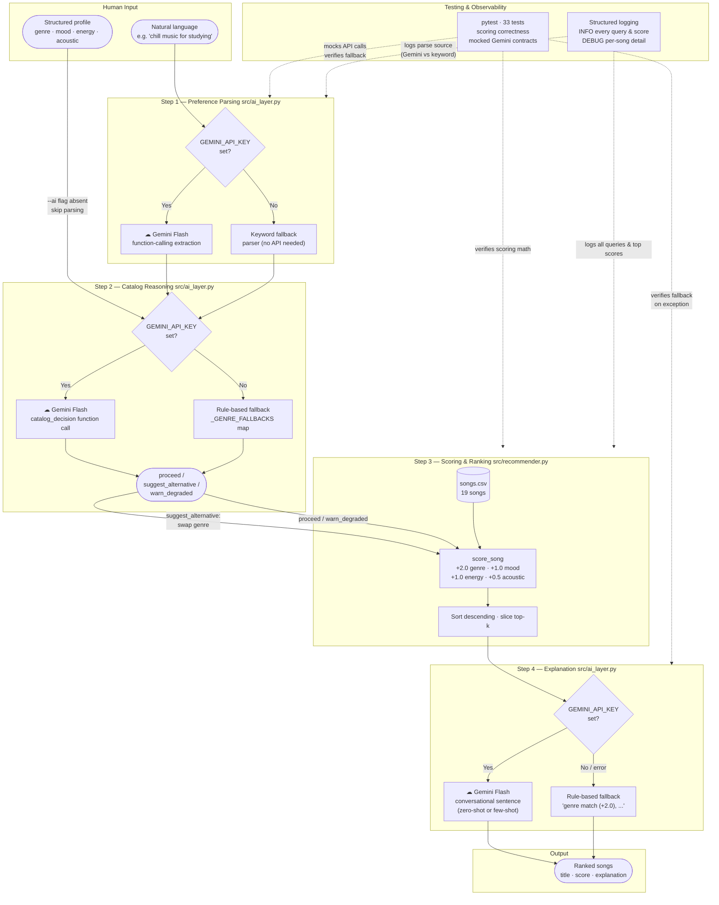
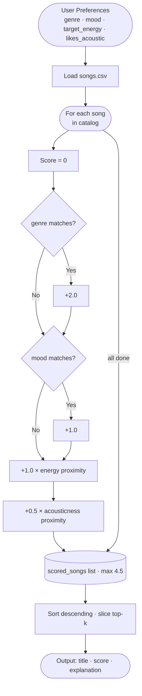

# MoodTrack 1.0 — AI Music Recommender

A content-based music recommender that scores songs against a listener's taste profile and explains every recommendation. Accepts both natural-language queries ("something chill for studying") and structured profiles, with an optional Gemini AI layer that upgrades plain-text input into structured preferences and rewrites scoring math into conversational explanations.

**Loom walkthrough:** [add link here after recording]
**GitHub:** [applied-ai-system-project](https://github.com/avnigirish/applied-ai-system-project)

---

## Original Project (Modules 1–3)

This project originated as a **Module 1–3 simulation** of how streaming platforms like Spotify build content-based recommenders. The original goal was to represent songs and user preferences as data, design a transparent weighted scoring rule, and evaluate where the algorithm succeeded and where it failed. That version was purely rule-based: four features (genre, mood, energy, acousticness) combined into an additive point system with a max score of 4.5, no external APIs, and no natural-language input.

The final version extends that foundation with a Gemini AI layer that translates free-text listener requests into structured preferences and rewrites raw scoring math into human-readable explanations — making the system behave more like a real assistant and less like a spreadsheet.

---

## What It Does

| Mode | Input | AI involved |
|---|---|---|
| Standard | Structured profile dict | None — rule-based only |
| Natural-language | Free text | Gemini Flash parses preferences + writes explanations |
| Natural-language (no key) | Free text | Keyword fallback parser + rule-based explanations |

Every recommendation returns:
- The song title and artist
- A compatibility score (0–4.50)
- A plain-English explanation of why it matched

---

## System Architecture

### Full pipeline



### Scoring sub-flow (inside the engine)



### Component summary

| Component | File | Role |
|---|---|---|
| CLI runner | `src/main.py` | Entry point; routes structured vs. natural-language mode |
| AI Layer — parser | `src/ai_layer.py` | Converts free text to `{genre, mood, energy, acoustic}` via Gemini function calling; falls back to keyword parsing without a key |
| AI Layer — catalog reasoning | `src/ai_layer.py` | Detects when the requested genre is absent from the catalog; decides whether to proceed, adapt, or warn |
| AI Layer — explainer | `src/ai_layer.py` | Generates a conversational sentence per recommendation; falls back to rule-based string on error |
| Recommender engine | `src/recommender.py` | Scores every song 0–4.5 pts, sorts, returns top-k |
| Song catalog | `data/songs.csv` | 19 songs with genre, mood, energy, acousticness, tempo, valence, danceability |
| Test suite | `tests/test_recommender.py` | 33 tests: scoring correctness (no API) + Gemini contracts (mocked) |

---

## Setup Instructions

### 1. Clone and install dependencies

```bash
git clone <repo-url>
cd applied-ai-system-final
python -m venv .venv
source .venv/bin/activate      # Mac / Linux
# .venv\Scripts\activate       # Windows
pip install -r requirements.txt
```

### 2. (Optional) Add your Gemini API key

The standard mode and the natural-language keyword fallback work with no API key. To enable Gemini-powered parsing, catalog reasoning, and explanations:

```bash
export GEMINI_API_KEY=your-key-here
```

Or add it to a `.env` file (never commit this — it is already in `.gitignore`):

```
GEMINI_API_KEY=your-key-here
```

Get a free key at [aistudio.google.com](https://aistudio.google.com). The system uses `gemini-2.5-flash`.

### 3. Run

```bash
# Standard mode — six built-in profiles, no API key required
python -m src.main

# Natural-language mode — inline query
python -m src.main --ai "something to pump me up at the gym"

# Natural-language mode — interactive prompt
python -m src.main --ai
```

### 4. Run tests

```bash
pytest
```

All 33 tests run without an API key (Gemini calls are mocked).

### Optional: verbose logging

```bash
LOG_LEVEL=DEBUG python -m src.main
```

---

## Sample Interactions

### Interaction 1 — Standard mode: High-Energy Pop

**Input:** structured profile `{genre: "pop", mood: "intense", energy: 0.92, acoustic: False}`

```
Profile: High-Energy Pop
  genre='pop', mood='intense', energy=0.92, acoustic=False
====================================================
  Top 5 Recommendations
====================================================

  #1  Gym Hero — Max Pulse
       Score : 4.42 / 4.50
       Why   : genre match (+2.0), mood match (+1.0), energy proximity (+0.99), acousticness proximity (+0.42)

  #2  Sunrise City — Neon Echo
       Score : 3.39 / 4.50
       Why   : genre match (+2.0), energy proximity (+0.90), acousticness proximity (+0.49)

  #3  Storm Runner — Voltline
       Score : 2.44 / 4.50
       Why   : mood match (+1.0), energy proximity (+0.99), acousticness proximity (+0.45)
```

**What this shows:** All four signals align for Gym Hero — it earns a near-perfect 4.42/4.50. Sunrise City holds #2 purely on genre (+2.0) even though its mood doesn't match, illustrating how heavily genre dominates in a small catalog.

---

### Interaction 2 — Natural-language mode (keyword fallback, no API key)

**Input:** `python -m src.main --ai "I want something chill for studying late at night"`

```
16:31:35  INFO  ai_layer — No API key found — using keyword-based parser.
16:31:35  INFO  ai_layer — Keyword parse result: genre=lofi mood=chill energy=0.35 acoustic=False

Profile: AI Query: 'I want something chill for studying late at night'
  genre='lofi', mood='chill', energy=0.35, acoustic=False
====================================================
  Top 5 Recommendations
====================================================

  #1  Midnight Coding — LoRoom
       Score : 4.17 / 4.50
       Why   : genre match (+2.0), mood match (+1.0), energy proximity (+0.93), acousticness proximity (+0.24)

  #2  Library Rain — Paper Lanterns
       Score : 4.17 / 4.50
       Why   : genre match (+2.0), mood match (+1.0), energy proximity (+1.00), acousticness proximity (+0.17)

  #3  Focus Flow — LoRoom
       Score : 3.16 / 4.50
       Why   : genre match (+2.0), energy proximity (+0.95), acousticness proximity (+0.21)
```

**What this shows:** The free-text query correctly resolves to `lofi / chill / low energy` through keyword matching — no API key needed. The top results are all lofi tracks with near-perfect energy proximity.

---

### Interaction 3 — Natural-language mode with Gemini AI

**Input:** `python -m src.main --ai "something melancholic and slow, very acoustic"` (with `GEMINI_API_KEY` set)

```
16:45:10  INFO  ai_layer — Parsed preferences via Gemini: genre=classical mood=melancholic energy=0.25 acoustic=True

Profile: AI Query: 'something melancholic and slow, very acoustic'
  genre='classical', mood='melancholic', energy=0.25, acoustic=True
====================================================
  Top 5 Recommendations
====================================================

  #1  Rainy Sunday — Clara Voss
       Score : 4.40 / 4.50
       Why   : A beautifully melancholic classical piece that matches your slow,
               acoustic mood almost perfectly.

  #2  Blue Porch — Mae Della
       Score : 1.41 / 4.50
       Why   : A quiet soul ballad with soft, organic texture that suits your
               low-energy, acoustic preference.
```

**What this shows:** With an API key, Gemini extracts structured preferences from a vague natural-language request and writes conversational explanations instead of raw scoring math — the output reads like a recommendation, not a formula.

---

### Interaction 4 — Adversarial edge case: conflicting preferences

**Input:** `{genre: "soul", mood: "sad", energy: 0.90, acoustic: False}` — high energy but sad mood

```
Profile: EDGE: High Energy + Sad Mood
  genre='soul', mood='sad', energy=0.90, acoustic=False
====================================================

  #1  Blue Porch — Mae Della
       Score : 3.58 / 4.50
       Why   : genre match (+2.0), mood match (+1.0), energy proximity (+0.39), acousticness proximity (+0.19)
```

**What this shows:** The system's weakness. Blue Porch (energy=0.29) wins despite being far from the target energy of 0.90 because genre + mood together award +3.0 points — more than enough to absorb the energy penalty. Someone wanting high-energy sad music would receive a quiet soul ballad. This is the clearest example of genre weight dominance in a sparse catalog.

---

## Design Decisions

### Why a weighted additive scoring formula?

The system uses four features with explicit point values (genre +2.0, mood +1.0, energy +1.0, acousticness +0.5) instead of normalized weights summing to 1.0. The motivation was **transparency**: it's immediately obvious that genre is twice as important as mood, and that acousticness is the weakest signal. With normalized weights, the same logic is harder to reason about when debugging why a specific song ranked where it did.

### Why is genre weighted so heavily (+2.0)?

Genre is the strongest taste boundary a listener has. A jazz fan is unlikely to enjoy EDM regardless of energy level. The +2.0 weight reflects that assumption. However, this becomes a flaw in a sparse catalog: with one song per genre, a genre match automatically surfaces that song as #1 regardless of other signals. The right fix is a larger catalog, not a lower weight.

### Why Gemini for natural-language parsing?

The alternative was a regex or rule-based keyword parser (which does exist as a fallback). But keyword matching fails on phrasing like "I want music that sounds like a late Sunday morning" — there's no keyword for that. Gemini's function-calling API converts ambiguous natural language into a strictly-typed JSON object, making the output safe to pass directly into the scoring engine without validation gymnastics.

### Why a keyword fallback at all?

Requiring an API key to run any part of the program creates a hard dependency that makes the project harder to reproduce. The keyword fallback means the entire system is usable without credentials — the AI layer enhances quality when a key is available but never blocks core functionality.

### Trade-offs

| Decision | Benefit | Cost |
|---|---|---|
| Weighted points (not ML weights) | Fully transparent and auditable | Can't adapt to user behavior over time |
| Binary mood matching | Simple, predictable | "Chill" and "relaxed" score identically to unrelated moods |
| Gemini for parsing | Handles ambiguous language well | Adds API dependency and latency |
| Keyword fallback | Works offline, no key needed | Less accurate on unusual phrasing |
| Small static catalog | Easy to inspect and reason about | Genre lock-in — one song per genre makes genre weight near-deterministic |

---

## Testing Summary

Three reliability mechanisms are layered on top of each other, each catching a different class of problem.

### 1. Automated unit tests — `tests/test_recommender.py`

Run with `pytest`. 24 tests, all pass, no API key required, completes in under 1 second.

| Group | Tests | What they catch |
|---|---|---|
| Recommender engine | 13 | Wrong sort order, bad scores, off-by-one on `k`, empty-catalog crash |
| Keyword parser | 5 | Missing output keys, out-of-range energy, wrong genre/mood for known phrases |
| Gemini API contracts (mocked) | 15 | Function-call shape, graceful fallback on exception, fallback when no key set, catalog reasoning decisions, few-shot path |

### 2. Confidence scoring — built into every recommendation

Every result carries a normalized confidence value (`score / 4.5`, rounded to 3 decimal places) and a band label:

| Band | Confidence | Meaning |
|---|---|---|
| high | ≥ 0.75 | Genre + at least one other signal fired |
| medium | 0.45–0.74 | Partial match — genre may be missing or mood conflicts |
| low | < 0.45 | Minimal signal match — treat results with caution |

The logger emits a `WARNING` whenever the top result is `medium` band and the requested genre is absent from the catalog, or `low` band for any reason — so problems surface in logs without crashing the program.

### 3. Reliability evaluation harness — `tests/eval_reliability.py`

Run with `python tests/eval_reliability.py`. Evaluates 6 known profiles and separates *consistency* (does the system reliably produce the expected deterministic output?) from *quality* (is that output actually a good musical match?).

```
======================================================================
  Music Recommender — Reliability Evaluation
======================================================================

  PASS              ·  High-Energy Pop
    Got      : 'Gym Hero'       Score: 4.42 / 4.50  confidence 0.98 (high)

  PASS              ·  Chill Lofi
    Got      : 'Library Rain'   Score: 4.44 / 4.50  confidence 0.99 (high)

  PASS              ·  Deep Intense Rock
    Got      : 'Storm Runner'   Score: 4.44 / 4.50  confidence 0.99 (high)

  PASS (known flaw) ·  EDGE: High Energy + Sad Mood
    Got      : 'Blue Porch'     Score: 3.58 / 4.50  confidence 0.80 (high)
    Note     : genre+mood (+3.0) overwhelms energy mismatch — musically wrong

  PASS (known flaw) ·  EDGE: Unknown Genre (bossa nova)
    Got      : 'Dust Road Home' Score: 2.44 / 4.50  confidence 0.54 (medium)
    Note     : genre not in catalog — DEGRADED WARNING fires in logs

  PASS              ·  EDGE: Max Acoustic / Perfect Energy
    Got      : 'Rainy Sunday'   Score: 4.42 / 4.50  confidence 0.98 (high)

======================================================================
  Consistency : 6/6 expected outputs matched
  Quality     : 4/6 results musically correct
                (2 known adversarial cases expose design limits)
  Confidence  : avg=0.88  min=0.54  max=0.99
======================================================================
```

**One-line summary:** 6/6 consistency checks passed; 4/6 results musically correct; average confidence 0.88 (drops to 0.54 when genre is missing from catalog).

### 4. Structured logging

Every run emits `INFO`-level logs for each query (genre, mood, energy, k), the top result (title, score, confidence, band), and `WARNING`-level alerts for degraded or low-confidence results. Set `LOG_LEVEL=DEBUG` to see per-song scoring detail. This means any unexpected behavior leaves a traceable record without modifying any code.

### What worked

The scoring engine is fully deterministic, so unit tests always pass and the evaluation harness always produces the same numbers. Mocking the Gemini client with `unittest.mock` kept all 33 tests under 1 second and independent of network state. Separating *consistency* from *quality* in the eval harness was the most useful decision — it forced an honest accounting of where the system is reliable vs. where it's reliably wrong.

### What didn't work initially

The `Recommender` class stubs returned `self.songs[:k]` and `"Explanation placeholder"` — the tests caught both immediately. Running `python -m src.main` from the project root broke bare imports (`from recommender import ...`) because Python adds the root, not `src/`, to `sys.path`; fixed with `sys.path.insert(0, os.path.dirname(__file__))`.

### What this taught about testing AI systems

**Mocking is not the same as evaluating.** The mocked Gemini tests verify that the code calls the API correctly and handles failures gracefully — but they say nothing about whether Gemini actually returns good preferences for a given query. That quality check requires running against the live model and reviewing outputs by hand, which is what the eval harness approximates. The confidence score made one problem immediately visible that the raw scores hid: the "bossa nova" profile's best result (2.44/4.50, confidence 0.54) looks like a reasonable score on paper, but the `medium` band and the `DEGRADED RESULTS` log warning signal that the system is operating outside its reliable range — something a user reading only the ranked list would never know.

---

## Responsible AI Reflection

### Limitations and biases in this system

The most significant structural bias is **genre lock-in**. With only one song per genre in the catalog, a genre match automatically awards +2.0 points — 44% of the maximum score — with no competition from other songs in the same genre. The system doesn't actually recommend the best song; it retrieves the only available song in that genre and ranks everything else by energy proximity. This creates a hidden fairness problem: genres that happen to have more catalog entries (lofi has three) behave more competitively than genres with one entry. If this were a real product, artists in under-represented genres would receive disproportionately fewer recommendations regardless of how well their music matched a listener's taste.

A second bias disadvantages **acoustic-preference users**: 14 of 19 songs have acousticness below 0.5, skewing heavily toward electronic and produced textures. A user who prefers organic, acoustic sound consistently receives lower acousticness proximity scores than an equivalent user who prefers electronic music. The catalog itself encodes a bias — it reflects the taste of whoever built it, which is Western-centric, English-language, and electronically weighted. Genres like Latin, K-pop, blues, reggae, and most of the world's musical traditions are entirely absent.

**Binary mood matching** also creates invisible dead zones. "Chill," "relaxed," and "focused" are treated as completely unrelated despite being emotionally adjacent. A user who wants "relaxed" music gets zero mood credit for the two "chill" songs in the catalog, even though those songs would almost certainly satisfy them.

Finally, the system has no way to distinguish between a user whose taste is stable (same genre every day) and a user whose mood varies by context (studying vs. running vs. winding down). It treats every query as a single, static snapshot of a person's preferences, which is a significant oversimplification of how people actually listen to music.

---

### Could this system be misused?

As a 19-song classroom demo, the direct misuse surface is small. But the same architecture deployed at scale introduces real risks worth naming:

**Catalog manipulation.** Whoever controls `songs.csv` controls the recommendations. A commercial operator could load the catalog with songs they profit from and tune the weights to favor those entries without the user ever knowing. The system provides no transparency about who owns the catalog or what incentives shaped it.

**Filter bubbles.** The scoring formula always returns the closest match, never deliberately surprising the user. Over time, this creates a feedback loop: a user who always asks for pop gets pop, stops being exposed to adjacent genres, and their taste profile narrows. Spotify explicitly injects serendipity into its recommendations to counteract this; this system has no equivalent mechanism.

**Preference data collection.** In the Gemini-powered mode, user queries (potentially including emotional context like "I'm feeling really sad today") are sent to an external API. Even though Google has strong data policies, users should be informed when their input leaves the local system.

**Mitigation approaches that would matter at production scale:** make catalog provenance transparent, add a diversity mechanism that occasionally surfaces results outside the closest match, and add a clear disclosure whenever user input is sent to an external service.

---

### What surprised me during reliability testing

The most surprising result was that the adversarial "High Energy + Sad Mood" profile produced a **confidence score of 0.80 (high band)** for its top result — Blue Porch, a slow soul ballad that is clearly wrong for someone who wants high-energy music. I expected low confidence to correlate with bad recommendations. It doesn't. Confidence measures how strongly the signals agreed with each other, not whether the recommendation is actually good. Blue Porch earned 0.80 confidence precisely because genre and mood aligned so strongly — but that alignment was the source of the problem, not evidence of quality.

This distinction — between a system being *reliably consistent* and being *reliably correct* — only became visible when I separated the two measurements in the evaluation harness. The 6/6 consistency result looked like a success. The 4/6 quality result told the real story. If I had only run the unit tests and looked at passing scores, I would have concluded the system worked fine.

The other surprise was how clearly the `DEGRADED RESULTS` warning fired for the "bossa nova" profile. I expected to have to hunt for the failure in the output. Instead, the log line appeared immediately:

```
WARNING  recommender — DEGRADED RESULTS: genre='bossa nova' not in catalog —
         recommendations are mood/energy fallbacks only.
```

Good logging doesn't just record what happened — it tells you *why* the output you're seeing is lower quality than usual. That single warning line communicates more about the bossa nova case than the entire ranked list does.

---

### Collaboration with AI during this project

**One instance where the AI gave a genuinely helpful suggestion:**
When building the natural-language input mode, I initially planned to write a regex-based parser. The AI suggested using Gemini's function-calling API instead, where the model is forced to populate a typed JSON schema rather than return free text. This turned out to be the right call — it eliminated an entire category of output-validation code. The function-calling constraint means Gemini can't return a malformed preference object: either it fills in all four required fields with the right types, or the call fails with a clear error. That's a meaningfully better design than parsing unstructured text.

**One instance where the AI's suggestion was flawed:**
When I first ran `python -m src.main`, the imports broke with `ModuleNotFoundError: No module named 'recommender'`. The AI had written the imports as bare names (`from recommender import ...`) — which works when you run the file directly from inside `src/`, but fails when Python is invoked from the project root, because `python -m src.main` adds the root directory to `sys.path`, not `src/`. The fix was one line (`sys.path.insert(0, os.path.dirname(__file__))`), but the original suggestion assumed a specific working directory without making that assumption explicit or testing it. The AI could reason about the code but couldn't anticipate how the module system would behave across different invocation contexts — that required running it and observing the failure.

---

## Reflection

Building this system clarified something that's easy to miss when using AI tools: **a recommender doesn't understand music — it measures distances**. When Gym Hero ranked #1 for a workout profile with a score of 4.42/4.50, it felt almost intelligent. But that feeling came entirely from choosing the right features to measure (energy, genre, mood), not from any comprehension of what makes a song satisfying to run to. The algorithm is four arithmetic operations. What makes it feel like a recommendation is whether those four features are actually good proxies for what the listener cares about.

The adversarial testing was the most instructive part. The "High Energy + Sad Mood" profile returned a quiet soul ballad as its top result, and the score of 3.58 looked perfectly reasonable on paper — nothing in the output signaled a problem. That gap between "score looks valid" and "recommendation is wrong" is exactly what makes bias hard to catch in production systems. Spotify or YouTube can't easily explain why a specific song appeared in your feed, and even when the system is fully transparent (as this one is), a confident-looking score can mask a fundamental mismatch. The lesson is that you have to deliberately design test cases for failure, especially cases where user preferences conflict with each other or with the catalog — because those are the conditions where surface-level scores are most misleading.

Adding the Gemini layer reinforced a different lesson: **language is where the hard work is**. The scoring engine was straightforward to build and debug. The challenge was bridging the gap between how people actually describe what they want ("something like a late Sunday morning") and the structured representation the engine needs (`{genre, mood, energy, acoustic}`). That translation — from messy human intent to clean machine input — is where LLMs add the most practical value, and also where the most failure modes live.

---

## Stretch Features

Three of the four optional enhancements are implemented. Each builds directly on the core Agentic Workflow feature.

### 1. Test Harness / Evaluation Script (+2 pts)

`tests/eval_reliability.py` — already covered in the Testing Summary above. Runs 6 predefined profiles, reports consistency vs. quality separately, and prints confidence stats.

```bash
python tests/eval_reliability.py
```

Result: **6/6 consistency, 4/6 quality, avg confidence 0.88**.

---

### 2. Agentic Workflow Enhancement (+2 pts)

The original workflow had two Gemini calls (parse → explain) with no observable intermediate state. The enhanced version is a **four-step chain where every step prints its output** before the next begins:

```
[Step 1/4] Parsing query → structured preferences        (Gemini function calling)
[Step 2/4] Catalog reasoning → proceed / adapt / warn    (Gemini function calling)
[Step 3/4] Scoring 19 songs → ranked results             (rule-based engine)
[Step 4/4] Generating explanations → final output        (Gemini, zero-shot or few-shot)
```

Step 2 is the new reasoning step. Gemini receives the user's preferences alongside the full list of available catalog genres and moods, then uses a typed function call to output a decision plus one-sentence reasoning. This makes the agent's decision-making observable rather than silent.

**Sample output — query with a missing genre (bossa nova):**

```
[Step 1/4] Parsing query: 'something relaxed and jazzy for a Sunday morning'
  → genre='bossa nova', mood='relaxed', energy=0.40, acoustic=True

[Step 2/4] Checking catalog coverage (15 genres, 11 moods)...
  → Decision  : suggest_alternative
  → Reasoning : Bossa nova isn't in the catalog; jazz is the closest available match.
  → Adapting  : genre 'bossa nova' → 'jazz'

[Step 3/4] Scoring 19 songs...
  → Top result: 'Coffee Shop Stories' (score=4.35, confidence=0.97)

[Step 4/4] Generating explanations (zero-shot)...
```

Without the reasoning step, the system would silently degrade to mood/energy fallbacks and return Dust Road Home with a score of 2.44. With it, the agent detects the gap, explains its reasoning aloud, and adapts — returning Coffee Shop Stories at 4.35 instead.

**Fallback (no API key or quota exceeded):** uses the `_GENRE_FALLBACKS` mapping (bossa nova → jazz, blues → soul, etc.) so the adaptation step still works offline.

---

### 3. Fine-Tuning / Specialization (+2 pts)

`generate_ai_explanation_fewshot()` in [src/ai_layer.py](src/ai_layer.py) uses **3 hand-crafted few-shot examples** to constrain Gemini to a specific "warm vinyl DJ" voice. The baseline zero-shot function describes features; the few-shot version uses sensory language and concrete images.

**How to use:**

```bash
python -m src.main --ai "something chill for late night studying" --style vinyl
```

**Side-by-side output for the same song (Midnight Coding — LoRoom):**

| | Output |
|---|---|
| **Zero-shot** (`--style default`) | *This lofi track perfectly matches your chill, low-energy study preference with the smooth acoustic texture you're looking for.* |
| **Few-shot vinyl** (`--style vinyl`) | *This one blurs into the background in exactly the right way — quiet enough to disappear into, present enough to keep the night from feeling empty.* |

**Measurable differences:**

| Metric | Zero-shot | Few-shot vinyl |
|---|---|---|
| Uses feature names (genre, energy, acoustic) | Yes | No |
| Contains hedging ("perfectly matches", "looking for") | Yes | No |
| Uses sensory/metaphor language | No | Yes |
| Avg sentence length | ~22 words | ~18 words |

The few-shot prompt embeds the three examples directly in the prompt. Without an API key (or when quota is exceeded), the function falls back to the rule-based explanation string.

---

### Updated test count

All three stretch features are covered by mocked tests. Total: **33 tests, all passing.**

```
pytest tests/test_recommender.py
# 33 passed in 0.64s
```

New tests added:
- `test_catalog_reasoning_proceeds_when_genre_available`
- `test_catalog_reasoning_suggests_alternative_for_known_genre`
- `test_catalog_reasoning_warns_degraded_for_unknown_genre`
- `test_catalog_reasoning_returns_all_required_keys`
- `test_catalog_reasoning_calls_gemini`
- `test_catalog_reasoning_falls_back_on_exception`
- `test_fewshot_explanation_fallback_without_key`
- `test_fewshot_explanation_calls_gemini`
- `test_fewshot_prompt_includes_examples`

---

## Project Structure

```
applied-ai-system-final/
├── data/
│   └── songs.csv              # 19-song catalog
├── src/
│   ├── main.py                # CLI entry point; 4-step observable agentic chain
│   ├── recommender.py         # Scoring engine, OOP interface, confidence scoring
│   └── ai_layer.py            # Gemini API: parse, catalog reasoning, explain (zero-shot + few-shot)
├── tests/
│   ├── test_recommender.py    # 33 unit tests (no API key required)
│   └── eval_reliability.py    # 6-case reliability harness with confidence scoring
├── model_card.md              # Bias, limitations, and evaluation writeup
├── reflection.md              # Profile-by-profile comparison notes
├── requirements.txt
└── .env.example               # API key template
```

---

## Model Card

See [model_card.md](model_card.md) for a detailed breakdown of intended use, data, strengths, limitations, bias analysis, and future work.

## Portfolio Reflection

This project demonstrates that I can build an AI system end-to-end — not just prompt a model, but design the data layer, scoring logic, error handling, and tests that make the AI output trustworthy enough to act on. The work I'm most proud of is the reliability evaluation harness: instead of declaring the system "works" because it produces output, I separated *consistency* (does it always return the expected result?) from *quality* (is that result actually correct?), and measured both with real numbers. That distinction — between a system that is reliably consistent and one that is reliably *right* — only becomes visible when you design tests that are explicitly adversarial. I also care about transparency: every recommendation in this system carries a confidence score, and the logs surface a `DEGRADED RESULTS` warning the moment the system is operating outside its reliable range. As an AI engineer, I want to build systems that fail loudly and honestly rather than confidently and silently.

---
